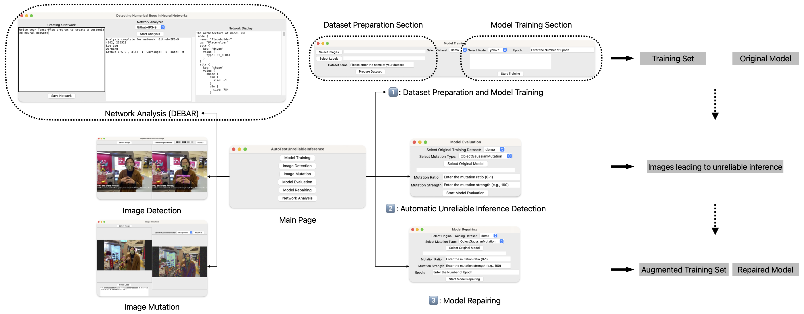

# Automatic Testing of DNN Models for Unreliable Inferences 

This repository provides the system for the testing of deep learning models. Specifically, the system provides two main functions: 
- testing and repairing object detection models include YOLOv3 and YOLOv7 models on popular datasets.
- detecting numerical bugs for TensorFlow neural networks. 

You can refer to this [demonstration video](https://hkustconnect-my.sharepoint.com/:v:/g/personal/mlick_connect_ust_hk/EXV8uDFtB1JFlXnbyclmzn8B4v2Gwj9J7_b6mVtslHNjuA?nav=eyJyZWZlcnJhbEluZm8iOnsicmVmZXJyYWxBcHAiOiJPbmVEcml2ZUZvckJ1c2luZXNzIiwicmVmZXJyYWxBcHBQbGF0Zm9ybSI6IldlYiIsInJlZmVycmFsTW9kZSI6InZpZXciLCJyZWZlcnJhbFZpZXciOiJNeUZpbGVzTGlua0RpcmVjdCJ9fQ&e=XBQWbd) to understand how to use our system.



Our system can automatically detect unreliable inferences and further repair the performance of YOLOv3 and YOLOv7 model on customized hand dataset, COCO, and ImageNet dataset.
Below is a snapshot of our experiment result on repairing YOLOv7, more details of how our system is designed and how effective is our system can be found on our [technical report](./doc/ITF_DNNTesting.pdf).


## Instruction For Building The Environment

### Prepare all sources
```
git clone --recursive git@github.com:CastleLab/ITF-DNNTesting-Deliverables.git
cd DEBAR && \
curl -L -o dataset.zip 'https://drive.google.com/uc?export=download&id=1GBHFd-fPIBWqJOpIC8ZO8g3F1LoIZYNn' && \
unzip dataset.zip -d computation_graphs_and_TP_list && \
cd ../
```

### Build environments

Our system is designed with two environments: client environment and server environment. 

To build the client environment:

```
pip install -r requirements.txt
```

To build the server environment, you need to install [nvidia-docker](https://github.com/NVIDIA/nvidia-docker) first (see how to install docker [here](https://codepyre.com/2019/01/installing-nvidia-docker2-on-ubuntu-18.0.4/)).

After docker is installed correctly, please use following command to build the server's environment:

```

# build container
docker build -t dnntesting -f MetaHand/Dockerfile .
docker run --ipc=host --name DNNTesting -ti -v ${PWD}:/root dnntesting:latest
apt-get update
apt-get install sudo pkg-config vim

# build debar environment
conda create -y -n debar python=3.5
conda activate debar
cd DEBAR && pip install -r requirements.txt
pip install --upgrade pip
pip install tensorflow==1.13.1
conda deactivate
cd ../

# build metahand environment
conda create -y -n metahand python=3.9
conda activate metahand
conda install -y pytorch==1.11.0 torchvision==0.12.0 torchaudio==0.11.0 cudatoolkit=11.3 -c pytorch
cd MetaHand && pip install -r requirements.txt && cd ../
cd MetaHand/tools/yolov7 && pip install -r requirements.txt

# exit the container while keeping it running
exit && docker start DNNTesting
```

## How To Run.

We provide a GUI interface for the easy of use. Simply running `python gui.py` in command line will launch our GUI interface.  
We also provide a detailed guidelines on the usage of each module (see [here](./pages/README.md)).

Instead, you can use our [APIs](./api.py) documented [here](./doc/usage.md).

