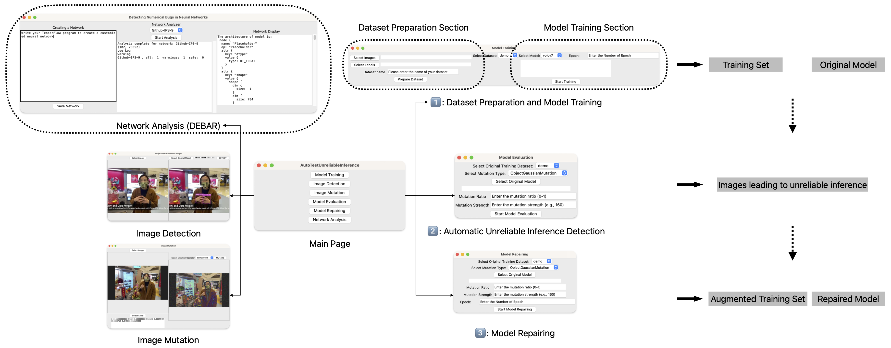
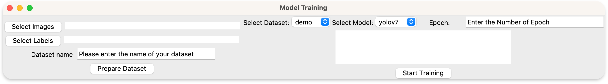
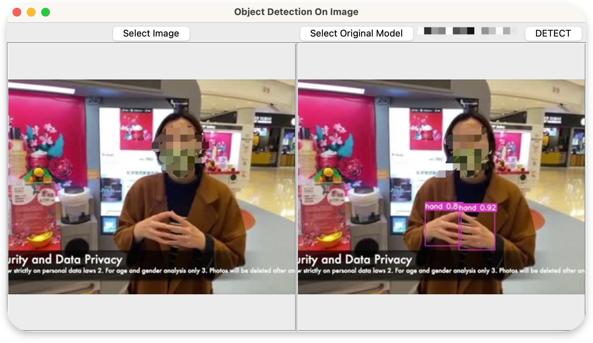
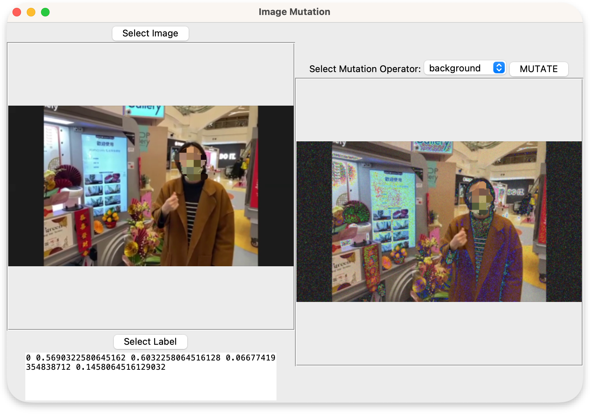
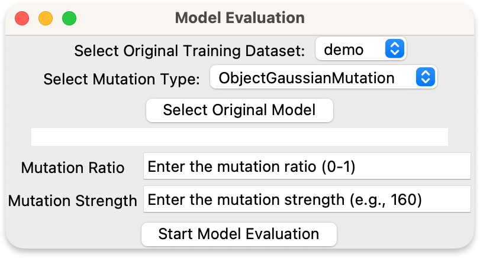
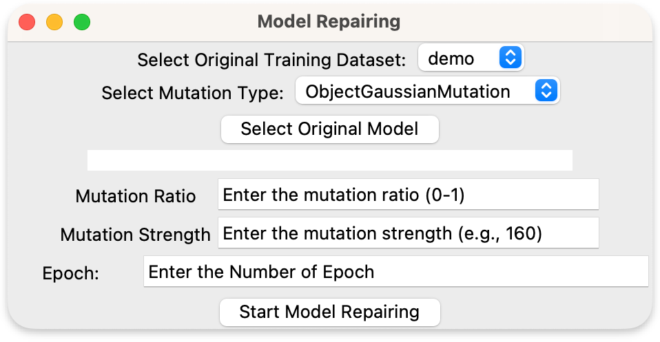
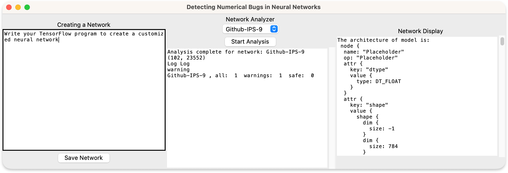

# Usage of Each Page



The main page of our system provides six modules, simply clicking one of them to enter a new page.

## Model Training Page


The model training page provides dataset preparation and model training functions to train an object detection model (i.e., YOLOv7 model).
Below are detailed steps:

1. Dataset Preparation: prepares the dataset by selecting the directory of training images and training labels.


    1.1. Select Images Button: Clicking this button opens a file dialog to browse and select the folder containing the training images. 

    1.2. Select Labels Button: Clicking this button opens a file dialog to browse and select the folder containing the corresponding labels.

    1.3. Dataset Name Entry: Enter the name of the dataset (e.g., "my_dataset").

    1.4. Prepare Dataset Button: Clicking this button initiates the dataset preparation process.

2. Model Training: starts the training process for the selected model using the prepared dataset.


    2.1. Select Dataset Option: Choose the dataset you want to train the model on using the dropdown menu.

    2.2. Select Model Option: Choose the model architecture you want to use for training using the dropdown menu.

    2.3. Epoch Entry: Enter the number of training epochs you want to run.

    2.4. Start Training Button: Clicking this button initiates the model training process.

The best weights resulting from model training will be saved in the specified directory. 
Ensure that you have the necessary dependencies (see [here](../README.md)) installed and the required data files available before using the Model Training Page.

## Image Detection Page



The image detection page provides various functions for object detection on images using the YOLOv7 model. 
Below are detailed steps:

1. Select Image: browse your file system to choose an image file in JPEG format for object detection.
2. Select Original Model: Click the "Select Original Model" button and browse your file system to choose 
the YOLOv7 model file, the YOLOv7 model should be in ".pt" format. 
3. Click the "DETECT" button to trigger the detection process., make sure you have selected an image and the original model. 
The detection result will be displayed on this page.

The selected image will be displayed in the upper-left section of the window. The detection result image will be displayed in the lower-right section of the window.
The image's aspect ratio will be maintained while resizing it to fit within a 400x400 pixel display area.

If you don't have an existing YOLOv7 model, please use page [Model Training Page] to train an original YOLOv7 model first.
Optionally, you can download existing YOLOv7 models trained on COCO dataset from [here] (https://github.com/WongKinYiu/yolov7#testing).

## Image Mutation Page



The image mutation page provides functions for user to perform image mutation operations on selected images and labels.
Below are detailed steps:

1. Select Image: browse your file system to choose an image file in JPEG format for image mutation.
2. Select Label: browse your file system to select a label file in txt format used for mutation. 
The label file should store the object information inside this image following the YOLOv7 format (see below for introduction of YOLOv7 format).
3. Select Mutation Operator: we provide two types of mutation operators (i.e., background mutation and object mutation), 
these two mutation operators will add gaussian noise on either background or object in the target image.
4. Mutate Image: click "MUTATE" to start the mutating process. The mutated image will be displayed after the mutation process is finished.

<details>
<summary>Click to toggle the introduction of YOLOv7 label format.</summary>

```
<object-class> <x_center> <y_center> <width> <height>

Where:

    <object-class> - integer object number from 0 to (classes-1)

    <x_center> <y_center> <width> <height> - float values relative to width and height of image, it can be equal from (0.0 to 1.0]

    for example: <x> = <absolute_x> / <image_width> or <height> = <absolute_height> / <image_height>

    attention: <x_center> <y_center> - are center of rectangle (are not top-left corner)

    For example for img1.jpg you will be created img1.txt containing:

    1 0.716797 0.395833 0.216406 0.147222
    0 0.687109 0.379167 0.255469 0.158333
    1 0.420312 0.395833 0.140625 0.166667

```

Source of this introduction: https://github.com/WongKinYiu/yolov7/issues/503.

</details>

## Model Evaluation Page



The model evaluation page provides functions to detect unreliable inferences given a trained object detection model and its training dataset.
Below are detailed steps:

1. Select the original training dataset from the dropdown menu.
2. Choose the desired mutation type from the dropdown menu. Two mutation type is provided: "ObjectGaussianMutation" and "BackgroundGaussianMutation" (see our [report](../doc/ITF_DNNTesting.pdf) for details).
3. Click the "Select Original Model" button and browse to the location of the original model file.
4. Enter the mutation ratio (0-1) and mutation strength in their respective entry fields.
5. Click the "Start Model Evaluation" button to initiate the evaluation process.

The evaluation result will be stored as a `MetaHand/{mutation_type}_{mutate_strength}_fixMutRatio_centerXY_{mutate_ratio}_violations.txt` txt file.

## Model Repairing Page



The model repairing page provides functions to repair an object detection given a trained object detection model and its original training dataset.
Below are detailed steps:

1. Select the original training dataset from the dropdown menu.
2. Choose the desired mutation type from the dropdown menu. Two mutation type is provided: "ObjectGaussianMutation" and "BackgroundGaussianMutation" (see our [report](../doc/ITF_DNNTesting.pdf) for details).
3. Click the "Select Original Model" button and browse to the location of the original model file.
4. Enter the mutation ratio (0-1) and mutation strength in their respective entry fields.
5. Click the "Start Model Evaluation" button to initiate the evaluation process.

The repaired model will be stored as in directory: `./MetaHand/tools/yolov7/{data_name}_yolov7_{mutate_name}_*`, where `data_name` refers to the name of training dataset, 
`mutate_name` refers to the mutation type.

## Network Analysis Page (DEBAR)



The network analysis page provides functions for numerical analysis on neural networks. Below are detailed steps:

1. Network Selection: Select an existing network from the dropdown menu. Click the "Start Analysis" button to start the analysis.
2. Network Display: No action is required. The architecture of selected neural network will be displayed in this frame.
3. Analysis Result: No action is required. The analysis result of the selected network will be displayed after analysis stops.
4. Network Creation: Optional. If you want to create a new neural network, you can use the editing box on the left-hand side to write a tensorflow program generating a neural network.

When using the network creation function, you should follow tensorflow 1.13.1 grammar to write the tensorflow program.
